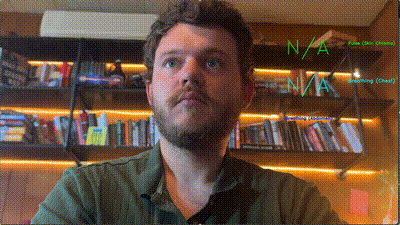

# User Guide

\mainpage SmartSpectra C++ SDK

SmartSpectra C++ SDK provides customizable, easy-to-integrate components for measuring vital signs such as heart rate and breathing rate for use in C++ applications.

<!-- BEGIN TOC -->
## Table of Contents

- [Getting Started](#getting-started)
  - [Prerequisites](#prerequisites)
  - [Quick Start](#quick-start)
- [Supported Systems & Architectures](#supported-systems--architectures)
- [Authentication & OnPrem Solution](#authentication--onprem-solution)
- [Installing Prebuilt SDK Packages from PPA (Ubuntu / Linux Mint)](#installing-prebuilt-sdk-packages-from-debian-repository-ubuntu--linux-mint)
  - [Setting up the Presage PPA](#setting-up-the-presage-debian-repository)
  - [Installing/Upgrading the Smart Spectra C++ SDK](#installingupgrading-the-smart-spectra-c-sdk-debian-package)
  - [Uninstalling all Presage Deb Packages and Removing the PPA](#uninstalling-all-presage-deb-packages-and-removing-the-presage-debian-repository)
- [Examples](#examples)
- [Developing Your Own Smart Spectra C++ Application](#developing-your-own-smart-spectra-c-application)
  - [Setting Up CMake](#setting-up-cmake)
  - [Output Metrics](#output-metrics)
  - [Using a Custom OnCoreMetricsOutput Callback](#using-a-custom-oncoremetricsoutput-callback)
  - [Using a Custom OnEdgeMetricsOutput Callback](#using-a-custom-onedgemetricsoutput-callback)
  - [Using a Custom OnVideoOutput Callback](#using-a-custom-onvideooutput-callback)
- [Bugs & Troubleshooting](#bugs--troubleshooting)
<!-- END TOC -->

## Getting Started

### Prerequisites

#### For Repository Setup

First, install tools needed to add the Presage repository:

```shell
sudo apt update
sudo apt install gpg curl
```

#### For Compiling Applications (Including Hello World Example)

To compile C++ applications that use the SmartSpectra SDK, you need the complete development environment:

```shell
# Essential build tools and development libraries
sudo apt update
sudo apt install -y build-essential git lsb-release libcurl4-openssl-dev libssl-dev pkg-config libv4l-dev libgles2-mesa-dev libunwind-dev gpg curl

# Install CMake 3.27.0 or newer
curl -L -o cmake-3.27.0-linux-x86_64.sh https://github.com/Kitware/CMake/releases/download/v3.27.0/cmake-3.27.0-linux-x86_64.sh
chmod +x cmake-3.27.0-linux-x86_64.sh
sudo ./cmake-3.27.0-linux-x86_64.sh --skip-license --prefix=/usr/local
```

**Note**: These development packages are required to compile any C++ application using the SDK, including the Hello World example below. For detailed build instructions, see <!-- GitLab: [Building & Packaging on Ubuntu / Linux Mint](docs/build_linux.md) -->[Building & Packaging on Ubuntu / Linux Mint](@ref build_linux).

### Quick Start

Get measuring vitals from video in just 3 steps!

#### 1. Get API Key

Obtain your free API key from <https://physiology.presagetech.com>

#### 2. Install SDK (Ubuntu 22.04/Mint 21)

```shell
# Add Presage repository
curl -s "https://presage-security.github.io/PPA/KEY.gpg" | gpg --dearmor | sudo tee /etc/apt/trusted.gpg.d/presage-technologies.gpg >/dev/null
sudo curl -s --compressed -o /etc/apt/sources.list.d/presage-technologies.list "https://presage-security.github.io/PPA/presage-technologies.list"

# Install SDK
sudo apt update
sudo apt install libsmartspectra-dev
```

#### 3. Hello World - Measure Vitals

Create `hello_vitals.cpp`:

```cpp
// hello_vitals.cpp
// SmartSpectra Hello Vitals - Minimal Example

#include <smartspectra/container/foreground_container.hpp>
#include <smartspectra/container/settings.hpp>
#include <smartspectra/gui/opencv_hud.hpp>
#include <physiology/modules/messages/metrics.h>
#include <physiology/modules/messages/status.h>
#include <glog/logging.h>
#include <opencv2/opencv.hpp>
#include <iostream>

using namespace presage::smartspectra;

int main(int argc, char** argv) {
    // Initialize logging
    google::InitGoogleLogging(argv[0]);
    FLAGS_alsologtostderr = true;
    
    // Get API key
    std::string api_key;
    if (argc > 1) {
        api_key = argv[1];
    } else if (const char* env_key = std::getenv("SMARTSPECTRA_API_KEY")) {
        api_key = env_key;
    } else {
        std::cout << "Usage: ./hello_vitals YOUR_API_KEY\n";
        std::cout << "Or set SMARTSPECTRA_API_KEY environment variable\n";
        std::cout << "Get your API key from: https://physiology.presagetech.com\n";
        return 1;
    }
    
    std::cout << "Starting SmartSpectra Hello Vitals...\n";
    
    try {
        // Create settings
        container::settings::Settings<
            container::settings::OperationMode::Continuous,
            container::settings::IntegrationMode::Rest
        > settings;
        
        // Configure camera (defaults work for most cases)
        settings.video_source.device_index = 0;
        // NOTE: If capture_width and/or capture_height is
        //     modified the HUD will also need to be changed
        settings.video_source.capture_width_px = 1280;
        settings.video_source.capture_height_px = 720;
        settings.video_source.codec = presage::camera::CaptureCodec::MJPG;
        settings.video_source.auto_lock = true;
        settings.video_source.input_video_path = "";
        settings.video_source.input_video_time_path = "";
        
        // Basic settings
        settings.headless = false;
        settings.enable_edge_metrics = true;
        settings.verbosity_level = 1;
        
        // Continuous mode buffer
        settings.continuous.preprocessed_data_buffer_duration_s = 0.5;
        
        // API key for REST
        settings.integration.api_key = api_key;
        
        // Create container
        auto container = std::make_unique<container::CpuContinuousRestForegroundContainer>(settings);
        auto hud = std::make_unique<gui::OpenCvHud>(10, 0, 1260, 400);
        
        // Set up callbacks
        // NOTE: These callbacks are designed to be lightweight. 
        // Any heavy post-processing or network communication should be performed outside these
        // callbacks (in asynchronous threads when necessary)
        // Delays of 25ms+ might affect incoming data
        auto status = container->SetOnCoreMetricsOutput(
            [&hud](const presage::physiology::MetricsBuffer& metrics, int64_t timestamp) {
                float pulse;
                float breathing;
                if (!metrics.pulse().rate().empty()){
                    pulse = metrics.pulse().rate().rbegin()->value();
                }
                if (!metrics.breathing().rate().empty()){
                    breathing = metrics.breathing().rate().rbegin()->value();
                }
                
                if (!metrics.pulse().rate().empty() && !metrics.breathing().rate().empty()){
                    std::cout << "Vitals - Pulse: " << pulse << " BPM, Breathing: " << breathing << " BPM\n";
                }
                hud->UpdateWithNewMetrics(metrics);
                return absl::OkStatus();
            }
        ); 
        if (!status.ok()) {
            std::cerr << "Failed to set metrics callback: " << status.message() << "\n";
            return 1;
        }
        
        status = container->SetOnVideoOutput(
            [&hud](cv::Mat& frame, int64_t timestamp) {
                if (auto render_status = hud->Render(frame); !render_status.ok()) {
                    std::cerr << "HUD render failed: " << render_status.message() << "\n";
                }
                cv::imshow("SmartSpectra Hello Vitals", frame);
                
                char key = cv::waitKey(1) & 0xFF;
                if (key == 'q' || key == 27) {
                    return absl::CancelledError("User quit");
                }
                return absl::OkStatus();
            }
        ); 
        if (!status.ok()) {
            std::cerr << "Failed to set video callback: " << status.message() << "\n";
            return 1;
        }
        
        status = container->SetOnStatusChange(
            [](presage::physiology::StatusValue imaging_status) {
                std::cout << "Imaging/processing status: " << presage::physiology::GetStatusDescription(imaging_status.value()) << "\n";
                return absl::OkStatus();
            }
        ); 
        if(!status.ok()) {
            std::cerr << "Failed to set status callback: " << status.message() << "\n";
            return 1;
        }
        
        // Initialize and run
        std::cout << "Initializing camera and processing...\n";
        if (auto status = container->Initialize(); !status.ok()) {
            std::cerr << "Failed to initialize: " << status.message() << "\n";
            return 1;
        }
        
        std::cout << "Ready! Press 's' to start/stop recording data.\nPress 'q' to quit.\n";
        if (auto status = container->Run(); !status.ok()) {
            std::cerr << "Processing failed: " << status.message() << "\n";
            return 1;
        }
        
        cv::destroyAllWindows();
        std::cout << "Done!\n";
        return 0;
        
    } catch (const std::exception& e) {
        std::cerr << "Error: " << e.what() << "\n";
        return 1;
    }
}
```

Create `CMakeLists.txt`:

```cmake
cmake_minimum_required(VERSION 3.27.0)
project(SmartSpectraHelloVitals CXX)

# Set C++ standard
set(CMAKE_CXX_STANDARD 17)
set(CMAKE_CXX_STANDARD_REQUIRED ON)

# Find required packages
find_package(SmartSpectra REQUIRED)
find_package(OpenCV REQUIRED)

# Create executable
add_executable(hello_vitals hello_vitals.cpp)

# Link libraries
target_link_libraries(hello_vitals
    SmartSpectra::Container
    SmartSpectra::Gui
    ${OpenCV_LIBS}
)
```

Build and run:

```shell
# Build
mkdir build && cd build
cmake .. && make

# Run with API key
./hello_vitals YOUR_API_KEY

# Or set environment variable
export SMARTSPECTRA_API_KEY=YOUR_KEY
./hello_vitals
```

🎉 **That's it!** Point your camera at your face and get real-time vitals measurement with a clean GUI overlay showing your pulse and breathing rates.



### Keyboard Shortcuts
During the run of any example, use the following keyboard shortcuts:
- `q` or `ESC`: exit
- `s`: start/stop recording data (**webcam input / streaming** mode only)
- `e`: lock/unlock exposure (**webcam input / streaming** mode only)

### Try the Pre-built Examples

```shell
# Continuous monitoring with live display
rest_continuous_example --also_log_to_stderr --camera_device_index=0 --auto_lock=false --api_key=YOUR_API_KEY_HERE
```

## Supported Systems & Architectures

We currently publicly provide SDK dependency packages only for **Ubuntu 22.04 and Mint 21 Linux** distributions running
on the **amd64/x86_64** architecture, but we already support many other systems and architectures for our partners  
and plan to release these publicly in the near future.

| OS                    | Package Type  | Architecture | Support Level / Status                                                                   |
|-----------------------|---------------|--------------|------------------------------------------------------------------------------------------|
| Ubuntu 22.04/Mint 21  | Debian        | `amd64`      | [Public package released](#installing-prebuilt-sdk-packages-from-debian-repository-ubuntu--linux-mint) |
| Ubuntu 22.04/Mint 21  | Debian        | `arm64`      | Package available to partners, release planned                                           |
| Ubuntu 24.04/Mint 22  | Debian        | `amd64`      | From-source builds in-progress, package planned                                          |
| Debian 11 & Debian 12 | Debian        | `amd64`      | Package available to partners, release planned                                           |
| Debian 11 & Debian 12 | Debian        | `arm64`      | Package available to partners, release planned                                           |
| RHEL 9/Fedora 41      | RPM           | `x86_64`     | Contact support                                                                          |
| RHEL 9/Fedora 41      | RPM           | `aarch64`    | Contact support                                                                          |
| macOS                 | PKG           | `arm64e`     | From-source builds available, package planned                                            |
| macOS                 | HomeBrew Cask | `arm64e`     | From-source builds available, package planned                                            |
| Windows               | Windows       | `x86_64`     | Contact support                                                                          |

If you're interested in partnering with us or seeing higher support levels for specific packages, please reach out to <[support@presagetech.com](mailto:support@presagetech.com)>.

### Authentication & OnPrem Solution

You'll need a Presage Physiology API key to use the SmartSpectra SDK. You can register for an account and obtain an API
key at <https://physiology.presagetech.com>. The Physiology REST API is queried via the internet by the SmartSpectra
SDKs to retrieve refined vitals data and metrics based on preprocessed data from video.

Thus, generally, an internet connection is required while using the standard public version of the SDK. However, we do
provide our **SmartSpectra OnPrem C++ SDK** solution to our partners, which runs entirely on the edge and uses a gRPC
connection protocol to hook up with a frontend written in any of the [gRPC-supported languages](https://grpc.io/docs/languages/).
If you're interested in using the OnPrem solution, please [contact us](https://presagetechnologies.com/contact-us).  

## Installing Prebuilt SDK Packages from Debian Repository (Ubuntu / Linux Mint)

### Setting up the Presage Debian Repository

You'll want to set up the Presage Debian Repository to be able to install and update the Smart Spectra C++ SDK. You'll only need to do this once on your system.

Run the following commands in your terminal.

1. Download the GPG key:

    ```shell
    curl -s "https://presage-security.github.io/PPA/KEY.gpg" | gpg --dearmor | sudo tee /etc/apt/trusted.gpg.d/presage-technologies.gpg >/dev/null
    ```

2. Copy the PPA list:

    ```shell
    sudo curl -s --compressed -o /etc/apt/sources.list.d/presage-technologies.list "https://presage-security.github.io/PPA/presage-technologies.list"
    ```

### Installing/Upgrading the Smart Spectra C++ SDK Debian Package

1. Update the `apt` database:

    ```shell
    sudo apt update
    ```

2. Install (or upgrade) the SDK:

    ```shell
    sudo apt install libsmartspectra-dev
    ```

### Uninstalling all Presage Deb Packages and Removing the Presage Debian Repository

1. Uninstall the SDK & other Presage packages:

    ```shell
    sudo apt remove libphysiologyedge-dev libsmartspectra-dev
    ```

2. Remove the repository:

    ```shell
    sudo rm /etc/apt/sources.list.d/presage-technologies.list
    ```

3. Remove the GPG key:

    ```shell
    sudo rm /etc/apt/trusted.gpg.d/presage-technologies.gpg
    ```

4. Update the `apt` database:

    ```shell
    sudo apt update
    ```

## Examples

You can find example C++ applications with descriptions and a more detailed walkthrough in the [samples](https://github.com/Presage-Security/SmartSpectra/tree/main/cpp/samples) directory.

## Developing Your Own Smart Spectra C++ Application

To begin developing your own Smart Spectra C++ application, we encourage you to start from the [minimal spot example](https://github.com/Presage-Security/SmartSpectra/tree/main/cpp/samples/minimal_rest_spot_example/main.cc) and borrow from the [Rest Continuous Example App](https://github.com/Presage-Security/SmartSpectra/tree/main/cpp/samples/rest_continuous_example/main.cc) as needed.

Please refer to the <!-- GitLab: [Installing Build Tools section](docs/build_linux.md#installing-build-tools) -->[Installing Build Tools section](@ref build_linux) of the build instructions for how to set up your environment.

### Setting Up CMake

Use the following CMake code for reference on how to set the `CMakeLists.txt` file for your application:

```CMake
cmake_minimum_required(VERSION 3.27.0)
project(MyProject CXX)

find_package(SmartSpectra REQUIRED)

add_executable(my_app main.cc)

target_link_libraries(my_app
        # Required: container for running the node graph; also links the video capture utilities 
        SmartSpectra::Container
        # Optional: for using the OpenCV-based HUD/GUI components we provide
        SmartSpectra::Gui 
)
```

### Output Metrics

All metrics are computed from video input, but currently, some are always computed on edge, and some in the Physiology Core library, which is typically served in the cloud, but also available to select customers in our OnPrem solution.
The use former use the Metrics protobuf data structure and are alluded to as "Edge metrics"; the latter use the MetricsBuffer protobuf data structure and
are alluded to as "Core metrics". Both output formats are documented in the article on <!-- GitLab: [Metrics Usage](docs/metrics_usage.md) -->[Metrics Usage](@ref metrics_usage).

### Using a Custom OnCoreMetricsOutput Callback

Typically, you will want to do something with the vitals data output from SmartSpectra & Physiology Core API.
The following code demonstrates how you can add your own callback to process and/or display the data:

```C++
MP_RETURN_IF_ERROR(container.SetOnCoreMetricsOutput([](const presage::physiology::MetricsBuffer& metrics, int64_t timestamp_microseconds) {
    LOG(INFO) << "Got metrics from Physiology REST API: " << metrics;
    return absl::OkStatus();
}));
```

**Note**: for this and subsequent callback examples, the `MP_RETURN_IF_ERROR(...);` macro is just a convenience wrapper around the `absl::Status` return type, which will forward it if the status is not `absl::OkStatus()` _by returning it_. If your calling function does not have the `absl::Status` return type, you can safely replace it by using `auto status = container.SetOnCoreMetricsOutput(...);` , and then check & handle the status as you see fit.

You can see how the callback is used to format metrics as a JSON string in the minimal_rest_spot_example app, how it is output to a file in the rest_spot_example app, and how it is used to plot vitals data in real time in rest_continuous_example app. For `presage::physiology::MetricsBuffer` structure reference, see
<!-- GitLab: [Metrics Usage](docs/metrics_usage.md) -->[Metrics Usage](@ref metrics_usage).

### Using a Custom OnEdgeMetricsOutput Callback

Some metrics are fully computed on edge on a framerate basis. To enable this behavior, you need to set `enable_edge_metrics` to true in the `Settings` object you use to initialize the container (see rest_continuous_example app for an example).
The following code demonstrates how you can add your own callback to process and/or display this data:

```C++
MP_RETURN_IF_ERROR(container.SetOnEdgeMetricsOutput([](const presage::physiology::Metrics& metrics) {
    LOG(INFO) << "Computed metrics on edge: " << metrics;
    return absl::OkStatus();
}));
```

For details on the `MP_RETURN_IF_ERROR(...);` macro, please consult the note in the section on [OnCoreMetricsOutput](#using-a-custom-oncoremetricsoutput-callback) above.
For `presage::physiology::Metrics` structure reference, see <!-- GitLab: [Metrics Usage](docs/metrics_usage.md) -->[Metrics Usage](@ref metrics_usage).

### Using a Custom OnVideoOutput Callback

If you need to draw something on top of the video stream or forward it to some form of GUI, you can do this by setting the `OnVideoOutput` callback.

```C++
MP_RETURN_IF_ERROR(container.SetOnVideoOutput([](cv::Mat& output_frame, int64_t timestamp_milliseconds) {
    cv::imshow("Video Output", output_frame);
    return absl::OkStatus();
}));
```

You can find how this callback is used to plot corresponding vitals data in real time directly over the video output in rest_continuous_example app.

For details on the `MP_RETURN_IF_ERROR(...);` macro, please consult the note in the section on [OnCoreMetricsOutput](#using-a-custom-oncoremetricsoutput-callback) above.

## Building the SDK

See the <!-- GitLab: [Building & Packaging on Ubuntu / Linux Mint](docs/build_linux.md) -->[Building & Packaging on Ubuntu / Linux Mint](@ref build_linux) section for more details.

- Parties that are interested in using C++ SDK on macOS: please refer to <!-- GitLab: [Building SmartSpectra SDK on macOS](docs/build_macos.md) -->[Building SmartSpectra SDK on macOS](@ref build_macos).

## Bugs & Troubleshooting

For additional support, contact <[support@presagetech.com](mailto:support@presagetech.com)> or [submit a GitHub issue](https://github.com/Presage-Security/SmartSpectra/issues)
