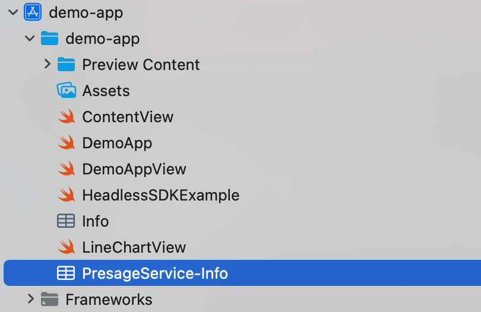
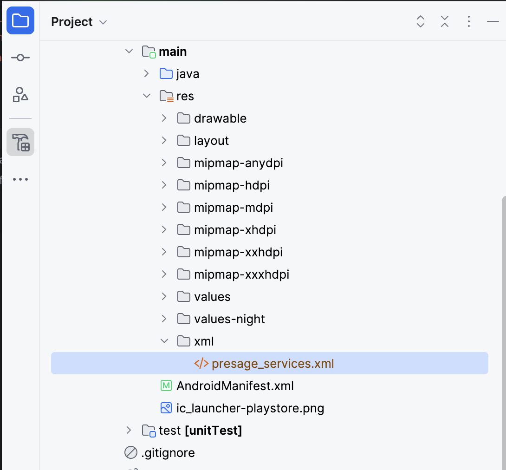

# Table of Contents

- [Table of Contents](#table-of-contents)
  - [1. Create an Account](#1-create-an-account)
  - [2. Log In](#2-log-in)
  - [3a. API Key (Development Only)](#3a-api-key-development-only)
    - [How to include your API Key](#how-to-include-your-api-key)
  - [3b. Register an OAuth App](#3b-register-an-oauth-app)
  - [4. Download Your Configuration File and place it in your App's repo](#4-download-your-configuration-file-and-place-it-in-your-apps-repo)

## 1. Create an Account

1. Navigate to the Presage Developer Admin Service [Portal](https://physiology.presagetech.com)
2. Click **Register** and fill in your email, password, and other required fields.
3. Check your email for a confirmation link and follow it to activate your account.

## 2. Log In

1. Go to the Presage Developer Admin Portal [Login](https://physiology.presagetech.com/auth/login)
2. Enter your email and password, then click **Submit**.
3. After successful login you will be redirected to your Portal page, where you can manage your API key and Apps registered for OAuth Authentication.

## 3a. API Key (Development Only)

> ⚠️ **Warning:** API Keys are intended for quick testing and local development. For production workloads, use the OAuth 2.0 flow with short-lived tokens.

### How to include your API Key

1. In your Dashboard, copy the **Active API Key** and then follow your platform's Documentation.

- [Swift](../swift/README.md)

- [Android](../android/README.md)

## 3b. Register an OAuth App

> **NOTE**
> OAuth is currently only supported for iOS and Android. If you are using a different platform, please use the API Key method.
> Currently, it requires testflight/appstore builds for iOS, and play store testing/release build for Android
> We may support sandbox builds/development builds in the future.

On your **Account → Registered App for OAuth** section:

1. Select your platform:
   - Apple
   - Android
2. Enter your **App ID** (bundle identifier or package name).
   - [How to find your Apple Bundle ID](https://developer.apple.com/documentation/appstoreconnectapi/bundle-ids)
   - [How to find your Android App ID](https://developer.android.com/build/configure-app-module)
3. Provide your **Org ID** if you're registering an Apple App or your Signing Key SHA-256 fingerprint if registering an Android App:
   - **Apple**: Org ID (e.g. `AB12CDE34F`)
       - [How to find your Org ID](https://developer.apple.com/help/account/)
   - **Android**: Certificate SHA-256 fingerprint
       - [How to find your Signing Key SHA-256 fingerprint](https://developers.google.com/android/guides/client-auth)
4. Click **Register App ID**.

## 4. Download Your Configuration File and place it in your App's repo

Once your app appears in the **Registered App(s) for OAuth** table:

- **Apple**
  Click **Download .plist** to fetch a `PresageServices-Info.plist` file and store in the root of your App's repo. No additional code/configuration authentication is needed.

  

- **Android**
  Click **Download .xml** to fetch a `presage_services.xml` file and store in the root of your App's `/src/main/res/xml/presage_services.xml`. No additional code/configuration for authentication is needed.

  
